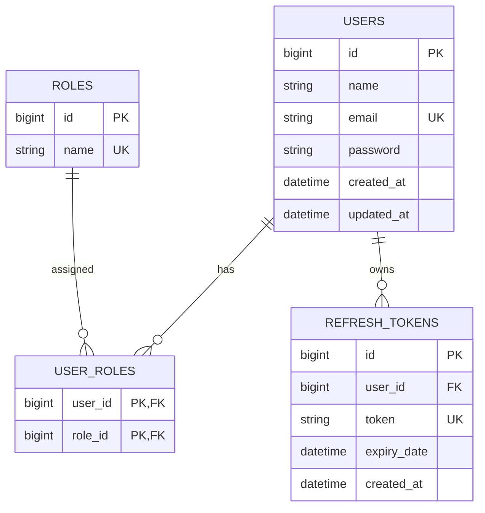
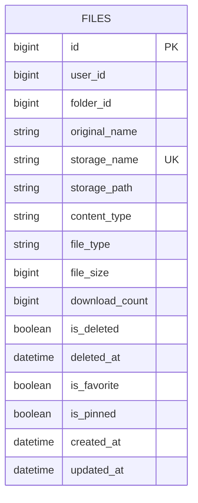
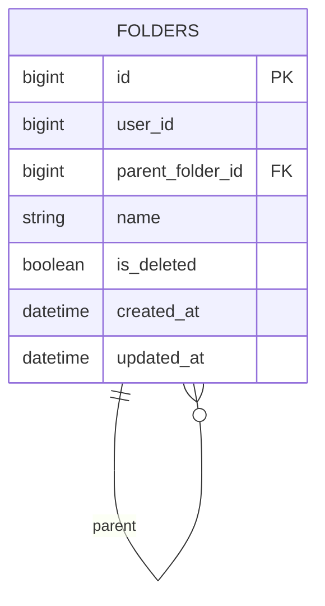

# DriveClone Database Schema & Data Architecture

This document details the relational database schema, indexing strategies, cross-service data boundaries, and SQL DDL scripts for **DriveClone**.

---

## 1. Database Architecture Principles

### 1.1 Microservice Data Isolation Rule
Each microservice exclusively owns its database. Microservices MUST NOT query or modify tables belonging to another microservice directly.

```text
  +-------------------+       +-------------------+       +-------------------+
  |   Auth Service    |       |   File Service    |       |  Folder Service   |
  +---------+---------+       +---------+---------+       +---------+---------+
            |                           |                           |
            v                           v                           v
  +-------------------+       +-------------------+       +-------------------+
  |      auth_db      |       |      file_db      |       |     folder_db     |
  |     (MySQL)       |       |     (MySQL)       |       |     (MySQL)       |
  +-------------------+       +-------------------+       +-------------------+
```

### 1.2 Cross-Database Reference Handling
- No physical foreign keys exist between different databases (e.g., `file_db.files.user_id` does NOT reference `auth_db.users.id` via SQL `FOREIGN KEY`).
- `user_id` and `folder_id` are maintained as **logical identifiers**. Integrity is enforced at the application service boundary.

---

## 2. Auth Service Database (`auth_db`)

### 2.1 Entity Relationship Diagram


### 2.2 MySQL DDL Script for `auth_db`
```sql
CREATE DATABASE IF NOT EXISTS auth_db CHARACTER SET utf8mb4 COLLATE utf8mb4_unicode_ci;
USE auth_db;

CREATE TABLE users (
    id BIGINT AUTO_INCREMENT PRIMARY KEY,
    name VARCHAR(100) NOT NULL,
    email VARCHAR(150) NOT NULL UNIQUE,
    password VARCHAR(255) NOT NULL,
    created_at DATETIME NOT NULL DEFAULT CURRENT_TIMESTAMP,
    updated_at DATETIME NOT NULL DEFAULT CURRENT_TIMESTAMP ON UPDATE CURRENT_TIMESTAMP,
    INDEX idx_users_email (email)
) ENGINE=InnoDB;

CREATE TABLE roles (
    id BIGINT AUTO_INCREMENT PRIMARY KEY,
    name VARCHAR(50) NOT NULL UNIQUE
) ENGINE=InnoDB;

CREATE TABLE user_roles (
    user_id BIGINT NOT NULL,
    role_id BIGINT NOT NULL,
    PRIMARY KEY (user_id, role_id),
    CONSTRAINT fk_user_roles_user FOREIGN KEY (user_id) REFERENCES users(id) ON DELETE CASCADE,
    CONSTRAINT fk_user_roles_role FOREIGN KEY (role_id) REFERENCES roles(id) ON DELETE CASCADE
) ENGINE=InnoDB;

CREATE TABLE refresh_tokens (
    id BIGINT AUTO_INCREMENT PRIMARY KEY,
    user_id BIGINT NOT NULL,
    token VARCHAR(255) NOT NULL UNIQUE,
    expiry_date DATETIME NOT NULL,
    created_at DATETIME NOT NULL DEFAULT CURRENT_TIMESTAMP,
    CONSTRAINT fk_refresh_tokens_user FOREIGN KEY (user_id) REFERENCES users(id) ON DELETE CASCADE,
    INDEX idx_refresh_token (token),
    INDEX idx_refresh_user (user_id)
) ENGINE=InnoDB;

-- Initial Seed Data
INSERT INTO roles (name) VALUES ('ROLE_USER'), ('ROLE_ADMIN');
```

---

## 3. File Service Database (`file_db`)

### 3.1 Data Model
The `files` table is the central metadata store for DriveClone items.



### 3.2 MySQL DDL Script for `file_db`
```sql
CREATE DATABASE IF NOT EXISTS file_db CHARACTER SET utf8mb4 COLLATE utf8mb4_unicode_ci;
USE file_db;

CREATE TABLE files (
    id BIGINT AUTO_INCREMENT PRIMARY KEY,
    user_id BIGINT NOT NULL,
    folder_id BIGINT NULL,
    original_name VARCHAR(255) NOT NULL,
    storage_name VARCHAR(255) NOT NULL UNIQUE,
    storage_path VARCHAR(500) NOT NULL,
    content_type VARCHAR(100) NOT NULL,
    file_type VARCHAR(50) NOT NULL,
    file_size BIGINT NOT NULL,
    download_count BIGINT NOT NULL DEFAULT 0,
    is_deleted BOOLEAN NOT NULL DEFAULT FALSE,
    deleted_at DATETIME NULL,
    is_favorite BOOLEAN NOT NULL DEFAULT FALSE,
    is_pinned BOOLEAN NOT NULL DEFAULT FALSE,
    created_at DATETIME NOT NULL DEFAULT CURRENT_TIMESTAMP,
    updated_at DATETIME NOT NULL DEFAULT CURRENT_TIMESTAMP ON UPDATE CURRENT_TIMESTAMP,

    -- Performance Indexing Strategy
    INDEX idx_files_user (user_id),
    INDEX idx_files_folder (folder_id),
    INDEX idx_files_user_deleted (user_id, is_deleted),
    INDEX idx_files_user_favorite (user_id, is_favorite),
    INDEX idx_files_user_pinned (user_id, is_pinned),
    INDEX idx_files_type (file_type),
    INDEX idx_files_user_recent (user_id, updated_at),
    INDEX idx_files_name (original_name)
) ENGINE=InnoDB;
```

---

## 4. Folder Service Database (`folder_db`)

### 4.1 Data Model & Recursive Hierarchy
Folders maintain a self-referencing relationship for hierarchical trees.



### 4.2 MySQL DDL Script for `folder_db`
```sql
CREATE DATABASE IF NOT EXISTS folder_db CHARACTER SET utf8mb4 COLLATE utf8mb4_unicode_ci;
USE folder_db;

CREATE TABLE folders (
    id BIGINT AUTO_INCREMENT PRIMARY KEY,
    user_id BIGINT NOT NULL,
    parent_folder_id BIGINT NULL,
    name VARCHAR(255) NOT NULL,
    is_deleted BOOLEAN NOT NULL DEFAULT FALSE,
    created_at DATETIME NOT NULL DEFAULT CURRENT_TIMESTAMP,
    updated_at DATETIME NOT NULL DEFAULT CURRENT_TIMESTAMP ON UPDATE CURRENT_TIMESTAMP,

    CONSTRAINT fk_folder_parent FOREIGN KEY (parent_folder_id) REFERENCES folders(id) ON DELETE CASCADE,
    INDEX idx_folders_user (user_id),
    INDEX idx_folders_parent (parent_folder_id),
    INDEX idx_folders_user_deleted (user_id, is_deleted)
) ENGINE=InnoDB;
```

---

## 5. Share Service Database (`share_db` - Post-MVP)

### 5.1 MySQL DDL Script for `share_db`
```sql
CREATE DATABASE IF NOT EXISTS share_db CHARACTER SET utf8mb4 COLLATE utf8mb4_unicode_ci;
USE share_db;

CREATE TABLE file_shares (
    id BIGINT AUTO_INCREMENT PRIMARY KEY,
    file_id BIGINT NOT NULL,
    shared_by_user_id BIGINT NOT NULL,
    shared_with_user_id BIGINT NOT NULL,
    permission VARCHAR(20) NOT NULL DEFAULT 'VIEWER', -- OWNER, EDITOR, VIEWER
    created_at DATETIME NOT NULL DEFAULT CURRENT_TIMESTAMP,
    updated_at DATETIME NOT NULL DEFAULT CURRENT_TIMESTAMP ON UPDATE CURRENT_TIMESTAMP,
    UNIQUE KEY uk_file_share (file_id, shared_with_user_id),
    INDEX idx_file_shares_user (shared_with_user_id)
) ENGINE=InnoDB;

CREATE TABLE folder_shares (
    id BIGINT AUTO_INCREMENT PRIMARY KEY,
    folder_id BIGINT NOT NULL,
    shared_by_user_id BIGINT NOT NULL,
    shared_with_user_id BIGINT NOT NULL,
    permission VARCHAR(20) NOT NULL DEFAULT 'VIEWER',
    created_at DATETIME NOT NULL DEFAULT CURRENT_TIMESTAMP,
    updated_at DATETIME NOT NULL DEFAULT CURRENT_TIMESTAMP ON UPDATE CURRENT_TIMESTAMP,
    UNIQUE KEY uk_folder_share (folder_id, shared_with_user_id),
    INDEX idx_folder_shares_user (shared_with_user_id)
) ENGINE=InnoDB;
```
