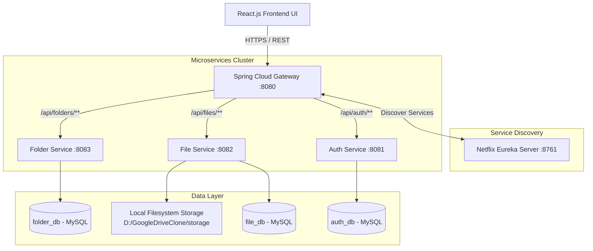
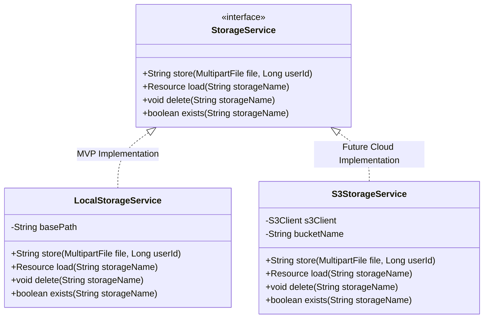
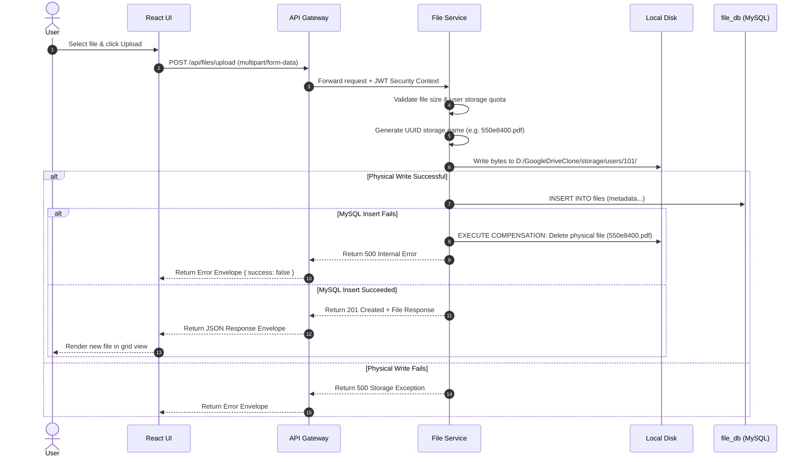
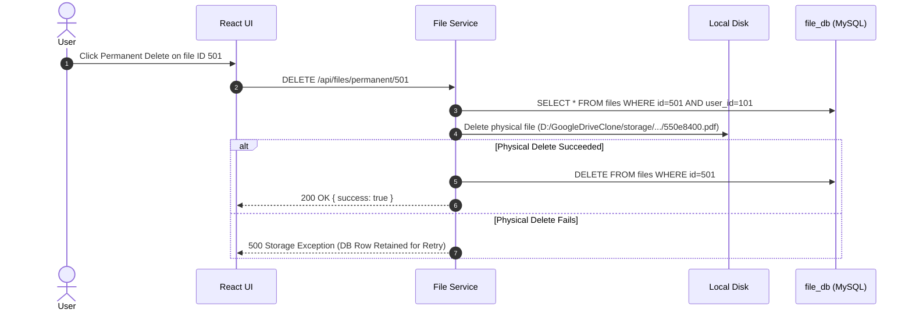

# DriveClone System Architecture Specification

This document provides the high-level architecture design, component responsibilities, interaction sequences, security models, storage abstraction patterns, and scalability blueprints for **DriveClone**.

---

## 1. High-Level Architecture Overview



---

## 2. Architectural Principles

### 2.1 Business-Capability Microservice Boundaries
Microservices in DriveClone are split strictly by cohesive business responsibilities rather than technical CRUD endpoints:

```text
File Service (Cohesive Business Boundary)
 ├── File Upload
 ├── File Download
 ├── File Preview Stream
 ├── File Rename
 ├── Soft Delete & Restore
 ├── Permanent Delete
 ├── Recycle Bin Management
 ├── Favorites & Pins
 ├── Filename Search & Type Filtering
 ├── File Statistics & Storage Quotas
 └── Storage Abstraction
```

*Anti-Pattern Avoided:* Creating separate `UploadService`, `DownloadService`, `FavoriteService`, and `TrashService` microservices, which causes operational overhead, distributed transaction lockups, and unnecessary network hops.

---

## 3. Core Component Specifications

### 3.1 React.js Frontend
- Single Page Application (SPA) managing authentication state, JWT storage, routing, and file dashboard views. Communicates exclusively with the API Gateway (`http://localhost:8080`).

### 3.2 Spring Cloud Gateway
- Single entry point for all API requests. Provides CORS management, request routing, and JWT authentication filtering before forwarding requests to internal microservices.

### 3.3 Auth Service (`auth-service`)
- Owns user registration, login, BCrypt password hashing, JWT access token generation (`sub=userId`, `roles=USER`), refresh token management, and identity verification.

### 3.4 File Service (`file-service`)
- Central service managing file metadata in `file_db` and physical file bytes on the host filesystem via the `StorageService` interface.

### 3.5 Folder Service (`folder-service`)
- Owns folder tree hierarchy, parent-child directory structures, folder navigation, and folder deletion in `folder_db`.

### 3.6 Eureka Service Registry (`eureka-server`)
- Dynamic service discovery hub where microservices register themselves at startup, allowing Gateway to route traffic dynamically without hardcoded host IP addresses.

---

## 4. Storage Abstraction Layer

To ensure long-term architectural flexibility, business logic in `FileServiceImpl` interacts exclusively with a `StorageService` Java interface.



---

## 5. Sequence Workflows & Data Consistency

### 5.1 File Upload Sequence & Local Compensation


### 5.2 Permanent Deletion Sequence


---

## 6. Security & Identity Architecture

```text
React Client             API Gateway               Microservice
    │                         │                         │
    │  Authorization: Bearer  │                         │
    ├────────────────────────>│                         │
    │      <JWT Token>        │ Validate Signature      │
    │                         ├────────────────────────>│ Extract Claims
    │                         │ Pass Request + User ID  │ Validate Ownership
```

- **Authentication:** Spring Security validates JWT signature using secret key.
- **Stateless Identity:** User identity (`userId`, `roles`) is extracted from JWT claims (`sub`). Downstream microservices enforce:
  `WHERE user_id = authenticatedUserId`.

---

## 7. Future Scalability Architecture (Phase 6)

```text
                             Client Applications
                                      │
                                      ▼
                                Load Balancer
                                      │
                                      ▼
                             Spring Cloud Gateway
                                      │
           ┌──────────────────────────┼──────────────────────────┐
           ▼                          ▼                          ▼
      Auth Service               File Service              Folder Service
           │                          │                          │
           ▼                          ├──────────────┐           ▼
        MySQL DB                      │              │        MySQL DB
                                      ▼              ▼
                                  MinIO / S3       Kafka (Event Bus)
                               (Object Storage)      │
                                            ┌────────┴────────┐
                                            ▼                 ▼
                                     Search Service     Notification
                                     (Elasticsearch)       Service
```
